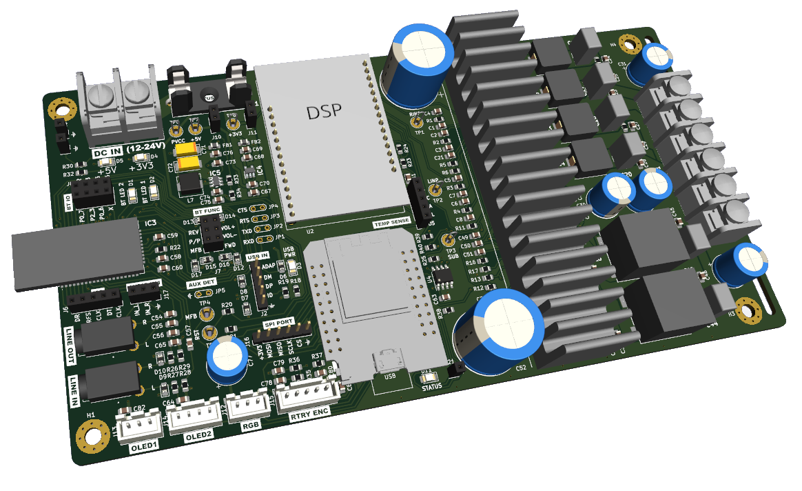

# Isetta 2.1 Channel Bluetooth + DSP Amplifier

Isetta 2.1 Channel Amplifier design is an inspired take on the iconic 'Paul Carmody's Isetta' 2.1 Home Audio Speaker, featuring powerful Class-D TPA3116D2 audio amplifier, seamless wireless audio streaming with Bluetooth 5.0 and sound energized by SigmaDSP Digital Audio Processor for enhanced sound expression.

 The chosen Dayton Audio 3.5" full-range drivers delivers detailed, natural sounding audio performance without distortion, whilst the inimitable long excursion 5" Tang Band subwoofer fills a medium sized room with powerful and deep rumbling bass.

### Features

- Class-D 2 x channels @ 50W & 1 x sub channel @ 100W
- Frequency response 40 - 20,000 Hz
- Powered by programmable SigmaDSP Audio Processor Engine
- Wireless audio streaming with Bluetooth 5.0
- Advanced Audio Codec (AAC) and Sub-band Coding (SBC)
- 20-bit Audio Stereo DAC with Signal-to-Noise Ratio (SNR) 95 dB
- Fine tunement of volume, bass and EQ presets
- Front-end single rotary control knob and OLED display
- Ported wooden enclosure design

### Design

